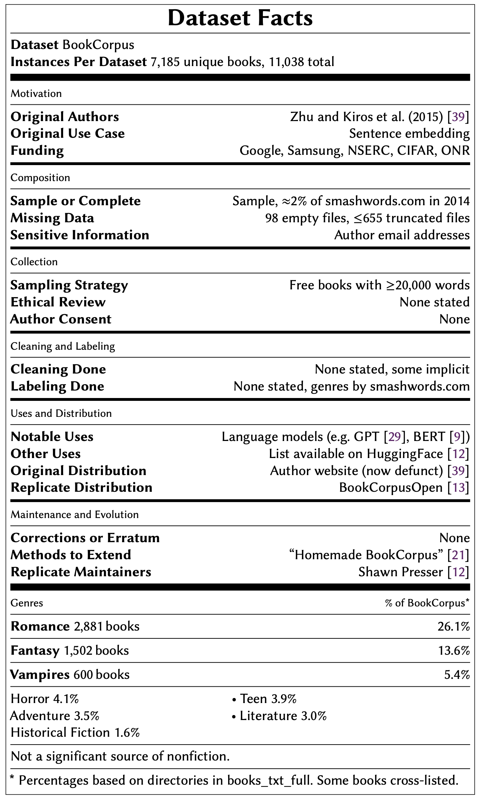

# BookCorpus Datasheet
Documentation effort for the BookCorpus dataset.
[(Link to arXiv paper)](https://arxiv.org/abs/2105.05241)


## Summary Data Card




## Context
This [datasheet](https://arxiv.org/abs/1803.09010) is inspired by [Bender and Gebru et al.](https://dl.acm.org/doi/abs/10.1145/3442188.3445922)'s notion of "documentation debt," and our observation that BookCorpus has been used widely but documented sparsely.

We plan to incorporate these findings in the [Hugging Face entry for BookCorpus](https://huggingface.co/datasets/bookcorpus).


## The Data

### BookCorpus dataset
[BookCorpus](https://huggingface.co/datasets/bookcorpus) is no longer available from the [original authors](https://yknzhu.wixsite.com/mbweb), though we obtained the dataset directly from their website through a security vulnerability which we have since notified them about.

We are not redistributing BookCorpus in full, however we include the following metadata files in the `data/BookCorpus` folder:
* `books_in_bookcorpus.csv` lists all text files (books) in BookCorpus, as downloaded from the authors' website, including the book's `location`, `category`, `word_count`, and `disk_usage` 
* `sentences_counted_8+.csv` lists all sentences that occurred eight or more times
* `count_of_sentence_counts.csv` lists data about the number of `unique_sentences` (including a `random_sentence`) that occurred `n` times
* `stolen_books.md` (pretty) lists books included in the original BookCorpus that now cost money to download from Smashwords.com

### BookCorpusOpen dataset
["BookCorpusOpen"](https://huggingface.co/datasets/bookcorpusopen) is included as "BookCorpus2" in [the Pile](https://arxiv.org/abs/2101.00027). Here are some background [details](https://github.com/soskek/bookcorpus/issues/27) about how BookCorpusOpen (also referred to as OpenBookCorpus, Books1, and BookCorpusNew) was constructed and published. The `data/BookCorpusOpen` folder contains one file:
* `2020-08-27-epub_urls.txt` lists smashwords.com URLs used to collect BookCorpusOpen


### Smashwords21 dataset
We collected all books listed on Smashwords as of April 2021. The `data/Smashwords21` folder contains two files:
* `smashwords_april_2021.csv` is the direct output from our scraping program that includes each book's `Link`, `Title`, `Author`,`Price`,`Words`, and more
* `smashwords_april_2021_dedup.csv` is a deduplicated version of the above data (based on each book's `Link`), which we use in our analysis


### Other Dataset recreation efforts
* [Replicate Toronto BookCorpus](https://github.com/sgraaf/Replicate-Toronto-BookCorpus)
* [Homemade BookCorpus](https://github.com/soskek/bookcorpus)


## The Code
We include three files used in our analysis:
* `DataSheet` contains the code we used for most of our analysis
* `Sentence Analysis` contains the code we used to inspect sentences
* `WordsAndBooksPerAuthor` contains the code we used to analyze author contributions


## How to Cite
To cite the original "datasheets for datasets" paper:
```
@inproceedings{gebru2018datasheets,
  title={Datasheets for datasets},
  author={Gebru, Timnit and Morgenstern, Jamie and Vecchione, Briana and Vaughan, Jennifer Wortman and Wallach, Hanna and Daum{\'e} III, Hal and Crawford, Kate},
  booktitle={Proceedings of the 5th Workshop on Fairness, Accountability, and Transparency in Machine Learning},
  url={https://arxiv.org/abs/1803.09010},
  year={2018}
}
```

To cite our paper (i.e. this BookCorpus datasheet / data card):
```
@article{bandy2021addressing,
      title={Addressing "Documentation Debt" in Machine Learning Research: A Retrospective Datasheet for BookCorpus},
      author={Bandy, Jack and Vincent, Nicholas},
      year={2021},
      journal={arXiv preprint arXiv:2105.05241},
      url={https://arxiv.org/abs/2105.05241}
}
```

----
💬 Head to the [discussion](https://github.com/jackbandy/bookcorpus-datasheet/discussions/1) with any questions or comments, or reach out directly to [Jack](https://twitter.com/jackbandy) and/or [Nick](https://twitter.com/nickmvincent)!
